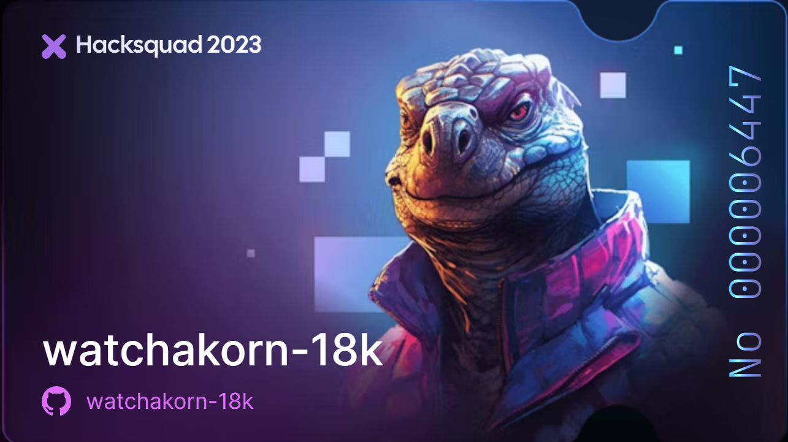

<h1 align="center">🌡️ Weather Today </h1>
<!--START_SECTION:weather-->

<div align="center">

&nbsp;&nbsp;&nbsp;&nbsp; | เมืองปากช่อง</br>Pak Chong City | &nbsp;&nbsp;&nbsp;&nbsp;
:---: | :---: | :---:
| Asia/Bangkok | |
24.2°C | 2024-09-12 06:20:22 | 1.6m/s
</div>

<!--END_SECTION:weather-->

<p align="centeadme-typing-svg.herokuapp.com?size=30&color=328AFF&center=true&vCenter=true&height=100&lines=Our+is+watchakorn-18k"
alt="adam-pw" /></a></p>
<p align="center">
   <a></a>
  <a href="https://discord.gg/AsZgC95SYu" alt="Discord" title="Dev Pro Tips Discussion & Support Server">
    </a>
   <a href="https://dev.to/watchakorn18k" >
    </a>
   
      <a href="https://hackernoon.com/u/hacker2675889" >
    </a>
    <a href="[https://hackernoon.com/u/hacker2675889](https://codeium.com)" >
    </a>
</p>

[](https://holopin.io/@wk18k)

<h1 align="center">🤳🏻My Profile</h1>

<div align="center">
<a href="https://app.daily.dev/wk18k"></a>
</div>
<p>


<h2 align="center">🔨 My TOOL</h2>

<table align="center">
  <tr></tr>
  <tr><td valign="top" width="100%">

### Frontend
    

<div align="center">

   

</div>

</td></tr><tr><td valign="top" width="100%">

### Backend

<div align="center"> 


</div>

</td>
</tr>
 <tr><td>

### Database

<div align="center"> 


</div>

</td>
</tr>
 <tr><td>
   
   
### Languages

<div align="center">    
<a href="https://www.python.org/" target="_blank"></a>   

</div>

</td></tr>

<tr><td>
  
### Tools

<div align="center">    


</div>

</td></tr>

<tr><td>
  
### Others

<div align="center">    

</div>

</td></tr>

<tr>
<td valign="top" >

### Cards
<div align="center">  
  
  
</div>
</td>
</tr>
</table>
</div>
<br>
    
## 💻 CODING STATS 
<!--START_SECTION:waka-->

```txt
From: 14 July 2021 - To: 07 September 2024

Total Time: 3,391 hrs 54 mins

Other                      1,218 hrs 50 mins>>>>>>>>>----------------   35.93 %
Python                     739 hrs 21 mins >>>>>--------------------   21.80 %
Go                         461 hrs 57 mins >>>----------------------   13.62 %
HTML                       311 hrs 4 mins  >>-----------------------   09.17 %
Lua                        133 hrs 27 mins >------------------------   03.93 %
JavaScript                 82 hrs 26 mins  >------------------------   02.43 %
Markdown                   65 hrs 12 mins  -------------------------   01.92 %
C#                         54 hrs 8 mins   -------------------------   01.60 %
TypeScript                 47 hrs 15 mins  -------------------------   01.39 %
JSON                       41 hrs 26 mins  -------------------------   01.22 %
CSS                        30 hrs 18 mins  -------------------------   00.89 %
Bash                       28 hrs 11 mins  -------------------------   00.83 %
Svelte                     24 hrs 57 mins  -------------------------   00.74 %
INI                        21 hrs 43 mins  -------------------------   00.64 %
PHP                        21 hrs 15 mins  -------------------------   00.63 %
YAML                       20 hrs 38 mins  -------------------------   00.61 %
Rust                       14 hrs 55 mins  -------------------------   00.44 %
Docker                     14 hrs 53 mins  -------------------------   00.44 %
Text                       14 hrs 7 mins   -------------------------   00.42 %
RPMSpec                    7 hrs 31 mins   -------------------------   00.22 %
```

<!--END_SECTION:waka-->

<br>

## 🪶 GitHub State

<table>
<tr>
   
<td></td>
<td></td>
<td></td>
<td></td>
</tr>
</table>

## 📐 Contribution Graph


