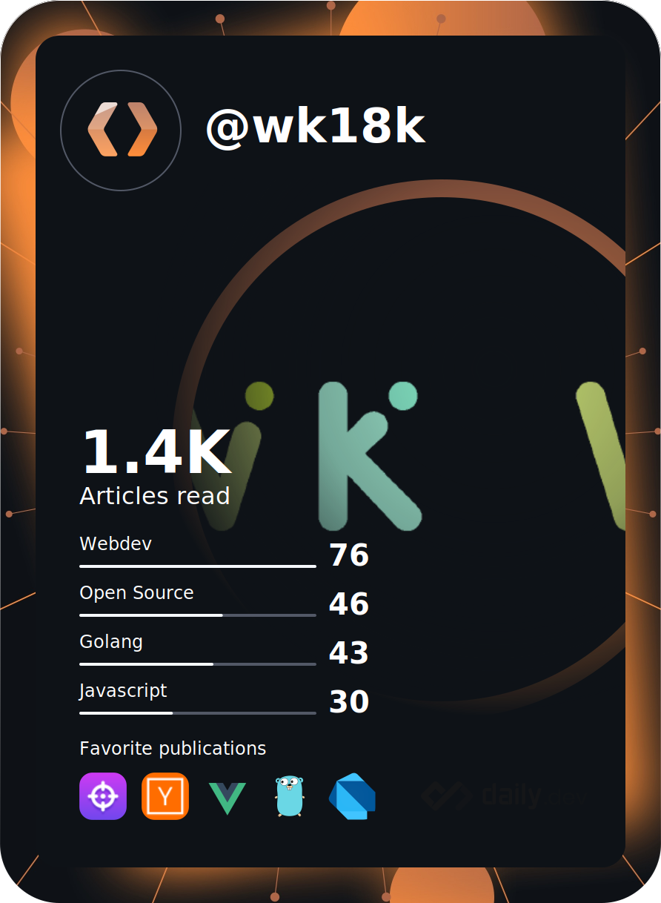

<h1 align="center">🌡️ Weather Today </h1>
<!--START_SECTION:weather-->

<div align="center">

&nbsp;&nbsp;&nbsp;&nbsp; | เมืองปากช่อง</br>Pak Chong City | &nbsp;&nbsp;&nbsp;&nbsp;
:---: | :---: | :---:
| Asia/Bangkok | |
22.9°C | 2024-02-18 05:17:47 | 2.8m/s
</div>

<!--END_SECTION:weather-->

<p align="centeadme-typing-svg.herokuapp.com?size=30&color=328AFF&center=true&vCenter=true&height=100&lines=Our+is+watchakorn-18k"
alt="adam-pw" /></a></p>
<p align="center">
   <a></a>
  <a href="https://discord.gg/AsZgC95SYu" alt="Discord" title="Dev Pro Tips Discussion & Support Server">
    </a>
   <a href="https://dev.to/watchakorn18k" >
    </a>
   
      <a href="https://hackernoon.com/u/hacker2675889" >
    </a>
    <a href="[https://hackernoon.com/u/hacker2675889](https://codeium.com)" >
    </a>
</p>

[](https://holopin.io/@wk18k)

<h1 align="center">🤳🏻My Profile</h1>

<div align="center">
  <a href="https://api.daily.dev/wk-18k" target="_blank">
    
  </a>
</div>
<p>


<h2 align="center">🔨 My TOOL</h2>

<table align="center">
  <tr></tr>
  <tr><td valign="top" width="100%">

### Frontend
    

<div align="center">

   


</div>

</td></tr><tr><td valign="top" width="100%">

### Backend

<div align="center"> 
<a href="https://www.mongodb.com/" target="_blank"></a>  
<a href="https://nodejs.org/" target="_blank"></a>  

</div>

</td>
</tr>
 <tr><td>
   
   
### Languages

<div align="center">    
<a href="https://www.python.org/" target="_blank"></a>   

</div>

</td></tr>

<tr><td>
  
### Tools

<div align="center">    


</div>

</td></tr>

<tr><td>
  
### Others

<div align="center">    


</div>

</td></tr>

<tr>
<td valign="top" >

### Cards

<div align="center">  


</div>
</td></tr>
</table>
</div>

<br>
    
## 💻 CODING STATS 
<!--START_SECTION:waka-->

```txt
From: 14 July 2021 - To: 10 February 2024

Total Time: 2,726 hrs 38 mins

Other                      1,212 hrs 13 mins>>>>>>>>>>>--------------   44.46 %
Python                     641 hrs 24 mins >>>>>>-------------------   23.52 %
HTML                       306 hrs 10 mins >>>----------------------   11.23 %
Lua                        127 hrs 39 mins >------------------------   04.68 %
JavaScript                 75 hrs 29 mins  >------------------------   02.77 %
Markdown                   54 hrs 22 mins  -------------------------   01.99 %
C#                         53 hrs 53 mins  -------------------------   01.98 %
TypeScript                 37 hrs 19 mins  -------------------------   01.37 %
JSON                       30 hrs 21 mins  -------------------------   01.11 %
CSS                        29 hrs 34 mins  -------------------------   01.08 %
```

<!--END_SECTION:waka-->

<br>

## 🪶 GitHub State

<table>
<tr>
   
<td></td>
<td></td>
<td></td>
<td></td>
</tr>
</table>

## 📐 Contribution Graph


